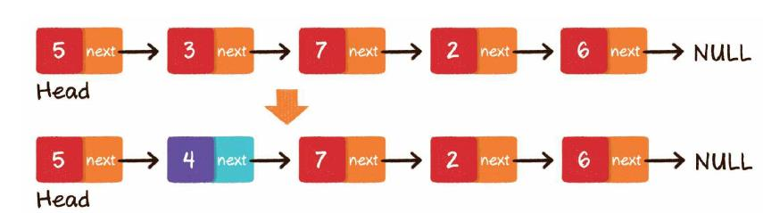

# 链表

## 单链表


单向链表的每一个节点又包含两部分，一部分是存放数据的变量data，另一部 分是指向下一个节点的指针next。

```javascript
class Element {
    constructor(data) {
        this.data = data; // 元素的值
        this.next = null;//元素下一个指引
    }
}
```

链表的第1个节点被称为头节点，最后1个节点被称为尾节点，尾节点的next指 针指向空。   
与数组按照下标来随机寻找元素不同，对于链表的其中一个节点A，我们只能根 据节点A的next指针来找到该节点的下一个节点B，再根据节点B的next指针找到下 一个节点C……  
要想让每个节点都能回溯到它的前置节点，我们可以使 用双向链表。

## 双链表

双向链表比单向链表稍微复杂一些，它的每一个节点除了拥有data和next指 针，还拥有指向前置节点的prev指针。


```javascript
class Element {
    constructor(data) {
        this.data = data; // 元素的值
        this.next = null;//元素下一个指引
        this.previou = null;//元素上一个指引
    }
}
```

#### 链表的存储方式。

 链表在内存中的存储方式则 是随机存储。 链表的每一个节点分布在内存的不同位 置，依靠next指针关联起来。这样可以灵活有效地利用零散的碎片空间。 


#### 链表的基本操作

#### **1）查找节点，**

链表不像数组那样可以通过下标快速进行定位，只能从头节点 开始向后一个一个节点逐一查找。例如给出一个链表，需要查找从头节点开始的第3个节点。


```javascript
class tableList {
    constructor(data) {
        this.head = null;// tableList的头部
        this.footer = null; // tableList的头尾部
        this.lenght = 0
    }
     find(data) {
        var headCopy = this.head // 从根节点开始遍历
        var result=[]
        while (headCopy !== null ) {  // 遍历  找到并返回对应值的节点数组 （查找的值可能在立链表中有多个）
            if(headCopy.data === data){ // 如果找到向 result中插入当前节点
            result.push(headCopy)
           }
            headCopy = headCopy.next
        }
      return result
    }
    }
```

#### 2）更新节点



```javascript
    updata(data,value){
        //更改指定元素值
        var findDate = this.find ( data );
        if(findDate.length>0){
            findDate.map(item=>{
                item.data=value
            })
        }else{  // 如果没有找到，就顺序插入这两个元素
            this.append(data,value)
        }
    }
```

#### 3）尾部插入


```javascript
    append(data) { //向尾部插元素
        for (var key in arguments) { // 接受多个参数
            var node = new Element(arguments[key]);
            if (this.head === null) {// 如果当前链表唯空，直接将head指向当前元素
                this.head = node
            } else {
                var headCopy = this.head //从根节点开始遍历
                while (headCopy.next !== null) { // 递归到list最后一个元素，并将最后一个元素的next指向要插入的元素
                    headCopy = headCopy.next  // 如果遍历到当前元素有next属性 就将当前元素赋值的内存指引指向当前元素的next
                }
                node.previou = headCopy // 直到next没有指引 将插入元素的previou 指向之前最后一个元素
                headCopy.next = node  //上一次尾元素的next指向当前插入node
                this.footer = node
            }
            this.lenght++ // length 统计
        }
    }
```

#### 4）头部插入


头部插入，可以分成两个步骤。

 第1步，把新节点的next指针指向原先的头节点。

 第2步，把新节点变为链表的头节点。

```javascript
 headPush(data){
        var node = new Element(data)
        node.next=this.head;  //第1步，把新节点的next指针指向原先的头节点。
        this.head=node// 第2步，把新节点变为链表的头节点。
        this.head.previou=node;  // 将上一个头的previou指向当前节点
    }
```

#### 5）中间插入


第1步，新节点的next指针，指向插入位置的next指针。

 第2步，新节点的previou指针，指向插入位置节点

第3步，插入位置的next指针，指向新节点。

```javascript
 insert(data, key) { // 在指定位置插入指定元素  
        var findDate = this.find(data);
        if (findDate.length>0) {
            var node = new Element(key)
           findDate.map(item=>{
            if (this.footer === item) {
                this.footer = node
            }
            node.next = item.next; // 新元素的next指向当前元素的next
            node.previou = item;// 新元素的previou指向当前元素
            item.next = node// 当前元素的next指向新元素
        })
        } else { // 如果指定元素不存在就先在list尾部顺序插入该元素，
      
            this.append(data,key)
        }
    }
```

#### 6）删除元素

尾部删除


头部删除


中间删除


这里需要注意的是，许多高级语言，如Java，拥有自动化的垃圾回收机制，所 以我们不用刻意去释放被删除的节点，只要没有外部引用指向它们，被删除的节点 会被自动回收。

```javascript
    remove(data){ //删除指定元素
        var findDate = this.find ( data );
        if(findDate.length>0){
            findDate.map(item=>{
                if(item.previou!==null &&item.next!==null){ // 判断是中间删除
                    item.previou.next=item.next //把要删除节点的前置节点的next指针，指向要删除元
                                                    //素的下一个节
                    item.next.previou=item.previou//把要删除节点的前置节点的next指针，指向要删除元
                                                    //素的下一个节
                        item=null
                }else  if(item.next===null){ //如果是尾部删除
                          item.previou.next=null // 把倒数第2个节点的next指针指向空即可。
                            item=null // 手动回收删除节点
                           this.footer=item.previou // 更新footer
                }else if(item.previou===null){ //如果是头部删除
                    item= item.next//，把链表的头节点设为原先头节点的next指针 。
                    item.previou=null// 删除 previou指引
                    this.head=item //更新头部
                }
            })
        }
    }
```

完整代码

```javascript
class Element {
    constructor(data) {
        this.data = data; // 元素的值
        this.next = null;//元素下一个指引
        this.previou = null;//元素上一个指引
    }
}
class tableList {
    constructor(data) {
        this.head = null;// tableList的头部
        this.footer = null; // tableList的头尾部
        this.lenght = 0
    }
    append(data) { //向尾部插入一个元素
        for (var key in arguments) {
            var node = new Element(arguments[key]);
            // var node = new Element(data);

            if (this.head === null) {
                this.head = node
            } else {
                var headCopy = this.head
                while (headCopy.next !== null) { // 递归到list最后一个元素，并将最后一个元素的next指向插入的元素
                    headCopy = headCopy.next  // 如果遍历到当前元素有next属性 就将当前元素赋值的内存指引指向当前元素的next
                }
                node.previou = headCopy // 直到next没有指引
                headCopy.next = node
                this.footer = node
            }
            this.lenght++
        }
    }
    find(data) {
        var headCopy = this.head
        var result=[]
        while (headCopy !== null ) {  // 遍历 查找到最查找元素  如果找到了返回当前元素，如果没有返回undefind
            if(headCopy.data === data){
            result.push(headCopy)
           }
            headCopy = headCopy.next
            
        }
      return result
    }
    // find(data) {
    //     var headCopy = this.head
    //     while (headCopy !== null && headCopy.data !== data) {  // 遍历 查找到最查找元素  如果找到了返回当前元素，如果没有返回undefind
    //         headCopy = headCopy.next
    //     }
    //     if (headCopy !== null && headCopy.data === data) {
    //         return headCopy
    //     } else {
    //         return undefined
    //     }
    // }
    headPush(data){
        var node = new Element(data)
        node.next=this.head;
        this.head.previou=node;
        this.head=node
    }
    insert(data, key) { // 在指定位置插入指定元素  
        var findDate = this.find(data);
        if (findDate.length>0) {
            var node = new Element(key)
           findDate.map(item=>{
            if (this.footer === item) {
                this.footer = node
            }
            node.next = item.next;
            node.previou = item;
            item.next = node
        })
        } else { // 如果指定元素不存在就先在list尾部插入该元素，并 插入随后的元素
          
            this.append(data,key)
        }
    }
    updata(data,value){
        //更改指定元素值
        var findDate = this.find ( data );
        if(findDate.length>0){
            findDate.map(item=>{
                item.data=value
            })
        }else{
            this.append(data,value)
        }
    }
    remove(data){ //删除指定元素
        var findDate = this.find ( data );
        if(findDate.length>0){
            findDate.map(item=>{
                if(item.previou!==null &&item.next!==null){
                    item.previou.next=item.next
                    item.next.previou=item.previou
                        item=null
                }else  if(item.next===null){
                          item.previou.next=null
                        item=null
                        this.footer=item.previou
                }else if(item.previou===null){
                    item= item.next
                    item.previou=null
                    this.head=item

                }
            })
        }
    }
    dataList(){ // 展示整个链表内容
        var headCopy = this.head;
        var str=[]
        while ( headCopy ){
              str.push(headCopy.data)
            headCopy = headCopy.next;
         
        }
        return str.join(',')
    }
}
var table = new tableList()

table.append('a', 'b', 'c','b','b','a','111')
// table.remove('a')
table.insert('111','ddddddddd')
table.remove('111')

console.log(table.find('ddddddddd')[0])
```

