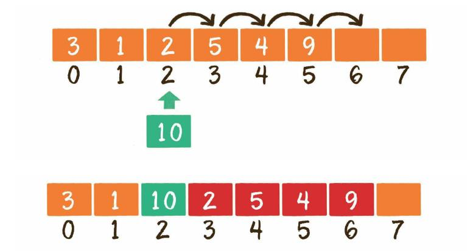
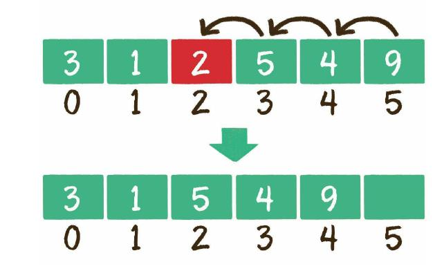
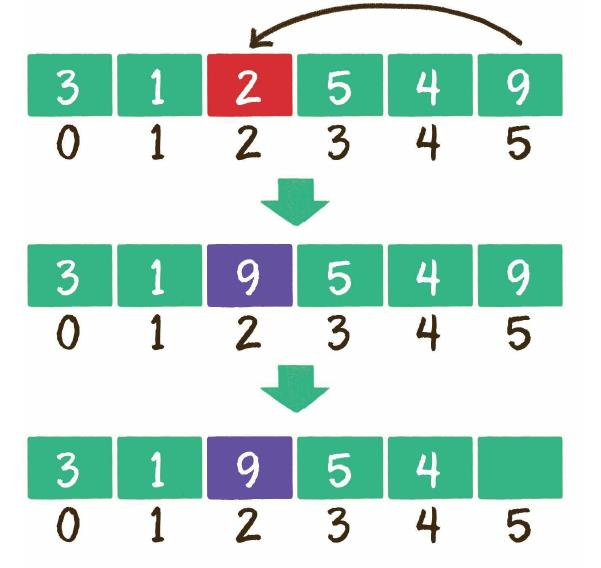

# 数组


正如军队里的士兵存在编号一样，数组中的每一个元素也有着自己的下标，只 不过这个下标从0开始，一直到数组长度-1。 数组的另一个特点，是在内存中顺序存储，因此可以很好地实现逻辑上的顺序 表。

## 数组在内存中的顺序存储，具体是什么样子呢？

内存是由一个个连续的内存单元组成的，每一个内存单元都有自己的地址。在 这些内存单元中，有些被其他数据占用了，有些是空闲的。 数组中的每一个元素，都存储在小小的内存单元中，并且元素之间紧密排列， 既不能打乱元素的存储顺序，也不能跳过某个存储单元进行存储。


在上图中，橙色的格子代表空闲的存储单元，灰色的格子代表已占用的存储单 元，而红色的连续格子代表数组在内存中的位置。

## 数组的基本操作

### 1、创建数组   new Array\(element0, element1, ..., elementn\); 读取数组

```javascript
var array1=new Array(1,2,3);
var  array2=[1,2,3]
var el= array2[0] ; // 读取下标为0的元素
```

###  2.更新元素

```javascript
var  array=[1,2,3] 
array[0]='a'; //给数组下标为0的元素赋值

```

### 3.插入元素

 


```javascript
//在讲插入之前。。
 //js中数组没有长度限制，如果获取一个不存在的长度元素会返回undefind
 var A=[1,2,3,4,5];
 A[8] //=> undefind
 //如果此时在下标为8的元素赋值
  A[8]=9 // => A (9) [1, 2, 3, 4, 5, empty × 3, 0]    A.leng=9
  // 因为没有长度限制 我们也可以指定当前数组的长度，
  A.length=14 // A=> (14) [1, 2, 3, 4, 5, empty × 9]  A.leng=14
 // 上面的操作给A数组后面加了9个空元素，使其长度最终达到14
 A.length=2 // A=>(2) [1, 2]
  // 上面的操作删除了A数组lengh>2后面的元素，使其长度最终等于2 尾部
```

#### 1）尾部插入 

尾部插入，是最简单的情况，直接把插入的元素放在数组尾部的空闲位置即 可，等同于更新元素的操作。  


```javascript
var a =[1,2,3]
a.push(4); //a=> (4)[1,2,3,4]  
//也可以直接给a的length赋值
a[a.lenght]=4 
```

### 2）中间插入




```javascript
 Array.prototype.insert=function(start,data){
    if(this.length<start){ //  如果数组的小于要插入的位置，就在相应位置赋值
        this[start]=data
    }else{
        let arr=this.slice(0);
        for(var i=0;i<(arr.length+1);i++){
            if(i>start){ //插入位置后面的元素位置顺位后移
                this[i]=arr[i-1] 
            }else if(i===start){
              this[i]=data
            }
         }
    }
  
 }
var array= new Array(1,2,3)
array.insert(1,'b') // =>array [1,2,'b',3]
array.insert(6,'a') // =>array[ 1, 2, 3, <2 empty items>, 'a' ]


//splice  同等实现上面的逻辑  page(数组对象方法)
var array= new Array(1,2,3)
array.splice(0,0,2) //  从数组array下标为0的位置，开始替换0个元素值为2  array=》[0, 1, 2,3 ]
//unshift() 向数组的开头添加一个或更多元素，并返回新的长度。
var array=new Array(1,2,3)
array.unshift('a') //=>4   array= ['a',1,2,3]
```

## 删除数组元素

数组的删除操作和插入操作的过程相反，如果删除的元素位于数组中间，其后 的元素都需要向前挪动1位。



**对于删除操作，其实还存在一种取巧的方 式，前提是数组元素没有顺序要求。**

例如下图所示，需要删除的是数组中的元素2，可以把最后一个元素复制到元素 2所在的位置，然后再删除掉最后一个元素。



```javascript
Array.prototype.delete=function(key){
    this[key]=this[this.length-1]  // 将需要删除元素替换成最后一个元素
   // this[this.length-1]=null    
    this.length=this.length-1 // 更改数组长度删除最后的空元素
}
var a=[1,2,3,4]
a.delete(2)
console.log(a) // => [ 1, 2, 4 ]
```

