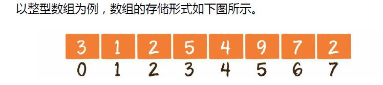
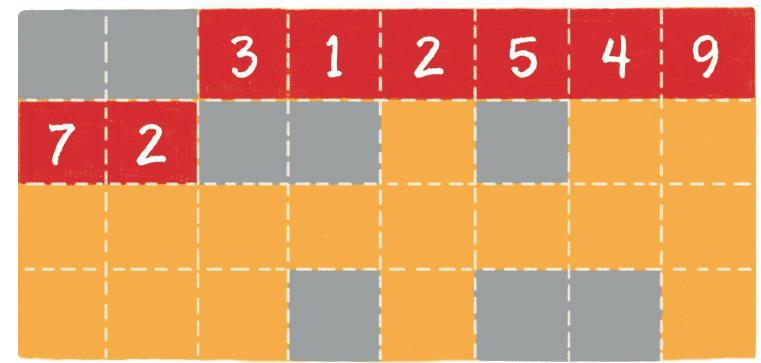
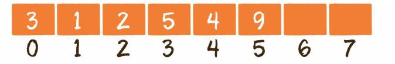
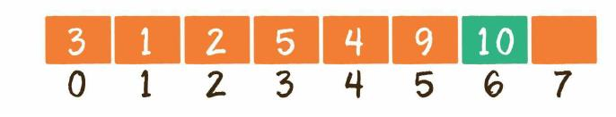

# 数组



正如军队里的士兵存在编号一样，数组中的每一个元素也有着自己的下标，只 不过这个下标从0开始，一直到数组长度-1。 数组的另一个特点，是在内存中顺序存储，因此可以很好地实现逻辑上的顺序 表。

## 数组在内存中的顺序存储，具体是什么样子呢？

内存是由一个个连续的内存单元组成的，每一个内存单元都有自己的地址。在 这些内存单元中，有些被其他数据占用了，有些是空闲的。 数组中的每一个元素，都存储在小小的内存单元中，并且元素之间紧密排列， 既不能打乱元素的存储顺序，也不能跳过某个存储单元进行存储。



在上图中，橙色的格子代表空闲的存储单元，灰色的格子代表已占用的存储单 元，而红色的连续格子代表数组在内存中的位置。

## 数组的基本操作

### 1、创建数组   new Array\(element0, element1, ..., elementn\); 读取数组

```javascript
var array1=new Array(1,2,3);
var  array2=[1,2,3]
var el= array2[0] ; // 读取下标为0的元素
```

###  2.更新元素

```javascript
var  array=[1,2,3] 
array[0]='a'; //给数组下标为0的元素赋值

```

### 3.插入元素



```javascript
//在讲插入之前。。
 //js中数组没有长度限制，如果获取一个不存在的长度元素会返回undefind
 var A=[1,2,3,4,5];
 A[8] //=> undefind
 //如果此时在下标为8的元素赋值
  A[8]=9 // => A (9) [1, 2, 3, 4, 5, empty × 3, 0]    A.leng=9
  // 因为没有长度限制 我们也可以指定当前数组的长度，
  A.length=14 // A=> (14) [1, 2, 3, 4, 5, empty × 9]  A.leng=14
 // 上面的操作给A数组后面加了9个空元素，使其长度最终达到14
 A.length=2 // A=>(2) [1, 2]
  // 上面的操作删除了A数组lengh>2后面的元素，使其长度最终等于2 尾部
```

#### 1）尾部插入



